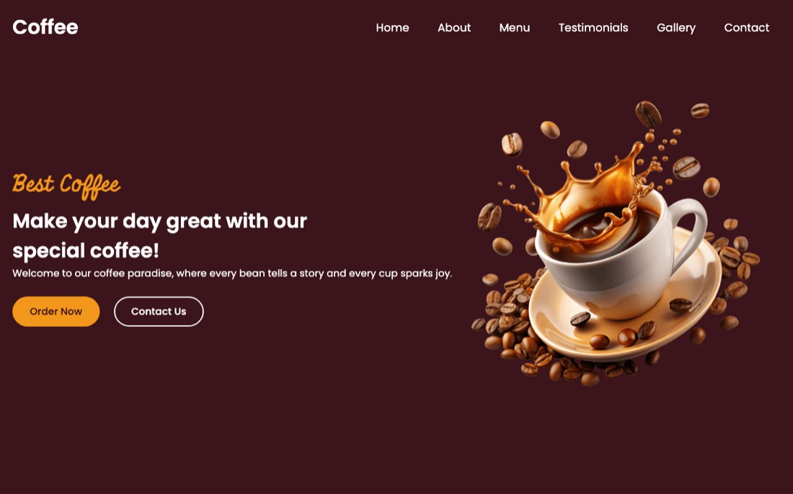

# Coffee Shop Website

A responsive, single-page website for a coffee shop, built with HTML, CSS and JavaScript. It has a hero banner, about section, menu, testimonials slider, photo gallery, contact section and footer.



## Features

- Fixed header with navigation links that smooth-scroll to each section
- Mobile menu (below 900px) that slides in from the side over a blurred backdrop, and closes when a link or the close button is clicked
- Hero section with headline and "Order Now" / "Contact Us" buttons
- About section with social media links
- Menu grid of six categories (hot beverages, cold beverages, refreshments, special combos, desserts, burger and fries)
- Testimonials carousel of five customer reviews built with Swiper: looping, drag to swipe, clickable pagination, prev/next arrows, and 1, 2 or 3 slides per view depending on screen width
- Photo gallery with a zoom effect on hover
- Contact details (sample placeholder address, email and website) and a contact form with required-field validation (front end only, nothing is sent)
- Responsive layouts at 900px and 640px breakpoints
- Theme colors, font sizes and radii defined as CSS custom properties

## Tech Stack

- HTML5
- CSS3 (Flexbox, custom properties, media queries)
- JavaScript (vanilla)
- [Swiper 11](https://swiperjs.com/) (via CDN)
- [Font Awesome 6](https://fontawesome.com/) icons (via CDN)
- Google Fonts

## Project Structure

```
Website-Coffee/
├── index.html     # Page markup for all sections
├── style.css      # Styling, hover effects and responsive breakpoints
├── script.js      # Mobile menu toggle and Swiper slider setup
├── screenshot.jpg # Screenshot used in this README
└── images/        # Hero, about, menu, gallery and testimonial images
```

## Getting Started

No build step is needed. Swiper and Font Awesome load from a CDN, so you need an internet connection.

```bash
git clone https://github.com/Pankkaj64/Website-Coffee.git
cd Website-Coffee
```

Then open `index.html` in any modern web browser.

## Credits

Inspired by a CodingNepal tutorial. Customer names and reviews are fictional sample content.
